# Media Forensics - final project (Qiuyu Tang)
### Folder structure
- dataset
  - CASIA
      - CASIA
      - CASIA_Facebook
      - CASIA_Wechat
      - CASIA_Weibo
      - CASIA_Whatsapp
  - Columbia (same as CASIA)
  - DSO
  - NIST16
- src
- extraction (saved feature npy files)
- output
- test.ipynb
- environment.yml

### Commands to run scripts
```
cd src
python *.py
```
#### Dataset
credit to __Robust Image Forgery Detection Against Transmission Over Online Social Networks__\
It contains CASIA, Columbia, NIST16, DSO datasets and versions uploaded and downloaded from Facebook, WeChat, Whatsapp, Weibo platforms.
#### Scripts
1. Observe image shape and suffix and cluster by those rules to obtain confusion matrix.
```clustering.py``` And the results are shown below.

<center class="four">
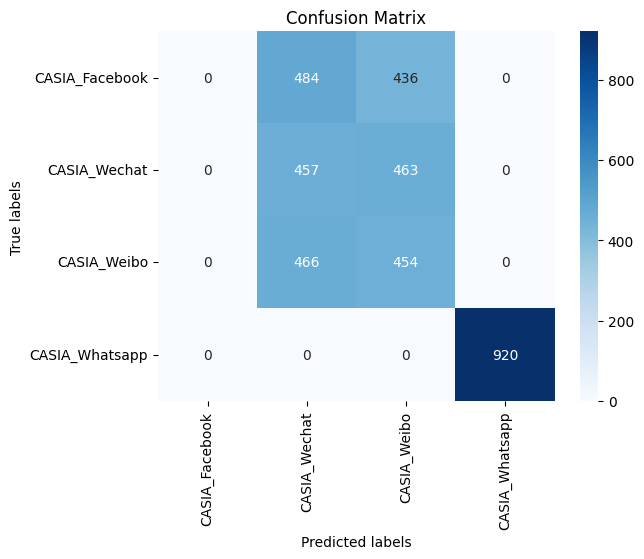
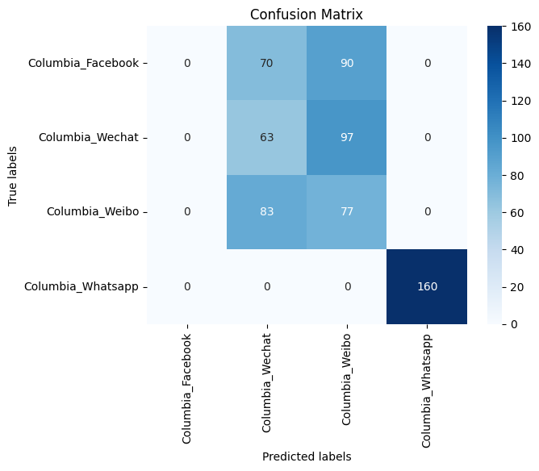
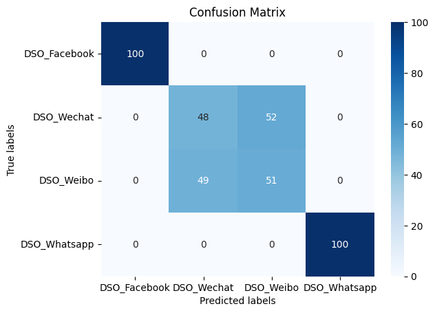
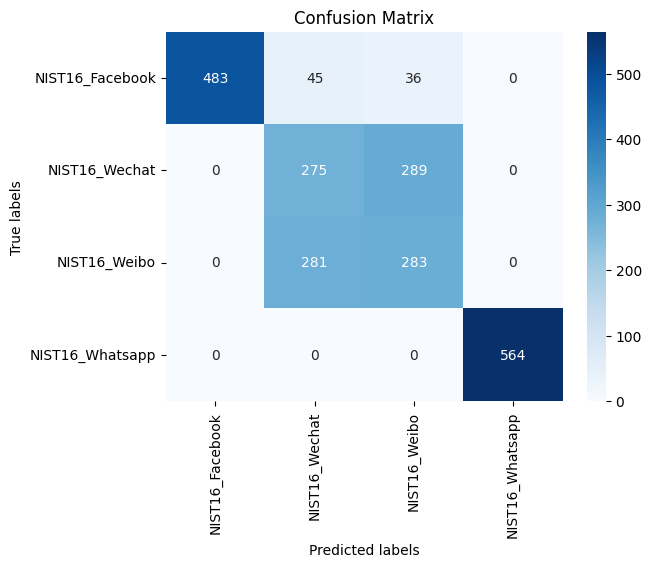
</center>

---
2. Extract the Metadata from each images of the datasets. ```exif_extraction_analysis.py```
---

3. To analyze data size change for images, `size_change_distribution.py` works perfectly. Check the following diagrams.

<center class="four">
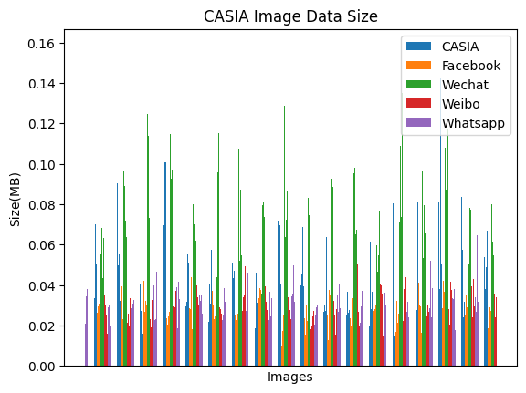
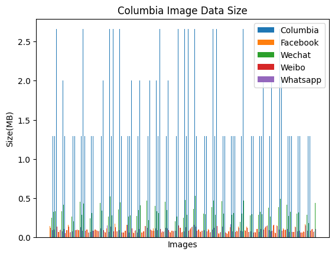
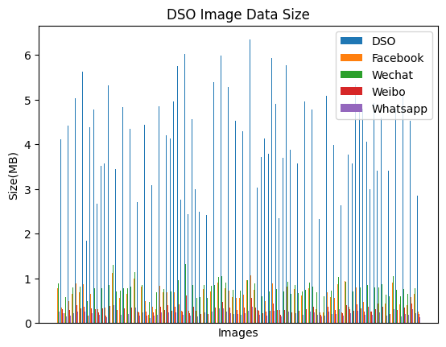
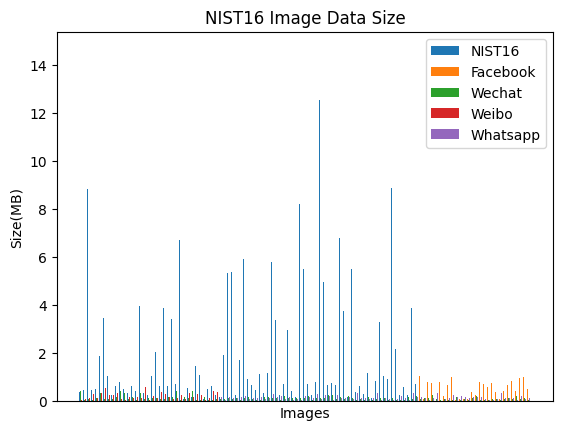
</center>

---
4. The JPEG-compressed images are always lose information during the JPEG compression process. In order to figure out the lossy change, I write the ` QT_estimator.py` according to __A Reliable JPEG Quantization Table Estimator__.
---
5. Utilizing pretrained large models like ResNet50 to get the visual artifacts and the results (see below) show from visual features noise from postprocessing from platforms wouldn't be detected. `feature_extraction.py`

<center class="four">
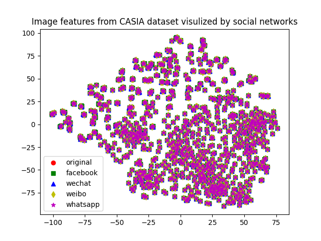
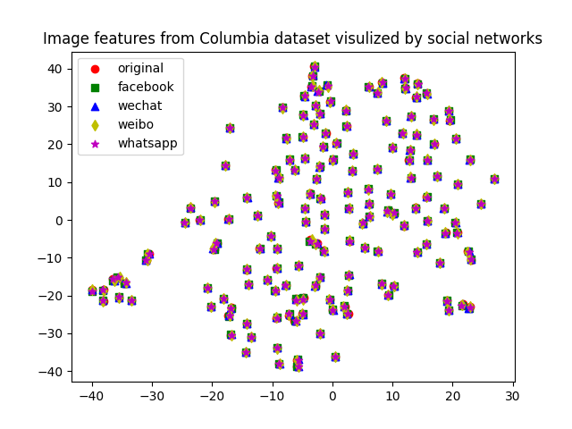
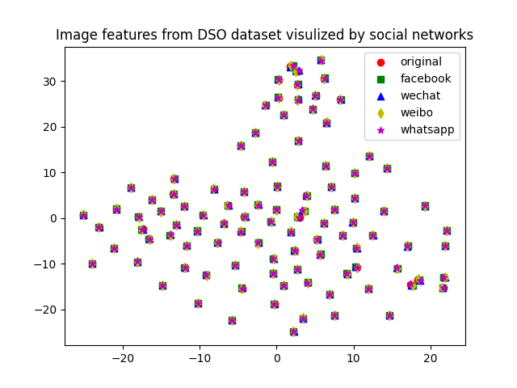
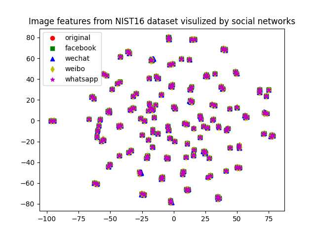
</center>

---
6. [1] trains a U-Net to model the noise from social networks but they just average the noise instead of considering each platform as a single one. The results remain the same as last one. `osn_noise.py`

<center class="four">
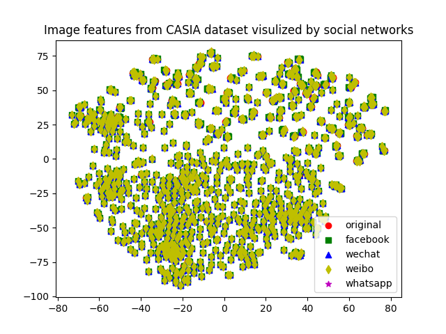
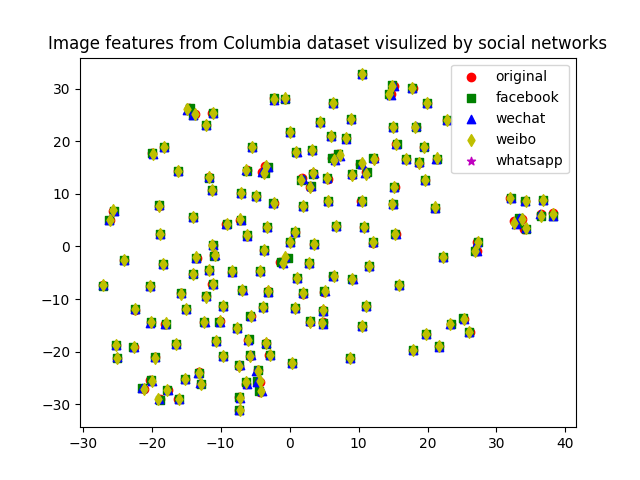
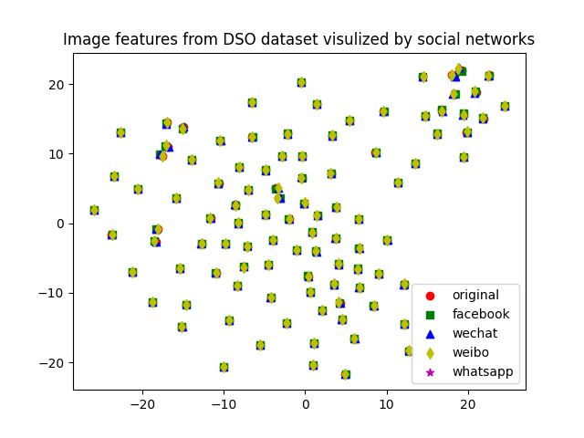
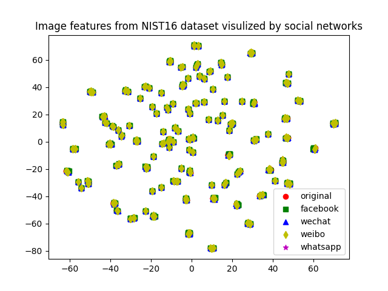
</center>

### Reference
[1] Wu, H., Zhou, J., Tian, J., Liu, J. and Qiao, Y., 2022. Robust image forgery detection against transmission over online social networks. IEEE Transactions on Information Forensics and Security, 17, pp.443-456. `https://github.com/HighwayWu/ImageForensicsOSN`\
[2] Nikoukhah, T., Colom, M., Morel, J.M. and von Gioi, R.G., 2022. A Reliable JPEG Quantization Table Estimator. Image Processing On Line, 12, pp.173-197.
